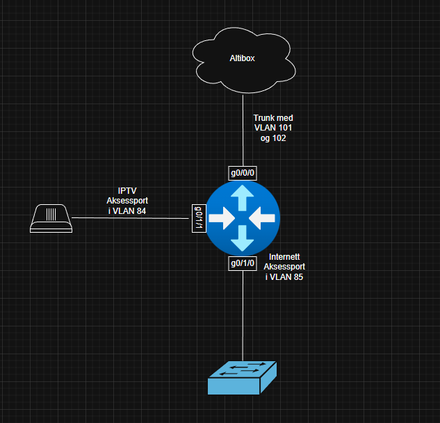

# AltiboxCisco
En guide for hvordan man kan sette opp en Cisco Ruter mot Altibox Fiber **uten** å bruke hjemmesentralen 

Løsningen erstatter Altibox sin hjemmesentral (**FMG/VMG**) med en Cisco-ruter. Jeg har brukt en **C1121-8P**, så portene kan variere fra ruter til ruter.
Altibox sin infrastruktur splitter IPTV og Internett trafikk i to separate VLAN på WAN-siden. Vi trunker dette til g0/0/0, og splitter det via subinterfaces.

Altibox bruker VLAN 101 for IPTV, og VLAN 102 for ren Internett-aksess. Vi deler også LAN-siden i to VLAN, 84 og 85, og det gjøres PAT/NAT overloading mellom LAN og WAN trafikk.

IPTV signaler fra Altibox sendes som **Multicast**, så vi må bruke IGMP proxy. I tillegg er det konfigurert statiske ruter mot Altibox sine IPTV-tjenester. Man kan også bruke DHCP Option 121 for å installere rutene automatisk, men det er kjent for å være litt wonky på Cisco IOS, så her er det hardkodet.


## Topologi:


## Du trenger:

- 1x Cisco Router med IOS-XE
- 1x Bidirectional Tx1310/Rx1550 SC SFP
- UTP kabler
- USB Konsollkabel
- USB Flash Drive

## Fremgangsmåte:
**1:** Tilpass startup-config.txt til dine behov (bytt ut passord osv), og flytt den til flash driven.

**2:** Plugg flash driven inn i ruteren, og kjør følgende kommando for å overskrive eksisterende startup-config.

```
copy usbflash0:startup-config.txt flash:startup-config.txt
```

**3:** Restart ruteren

**4:** Kjør ``` crypto key generate rsa modulus 2048 ```

***


### WAN konfigurasjon:

For å få en adresse av DHCP må vi enten spoofe mac-adressen på interfacet, eller sende DHCP options.

Interface G0/0/0 er konfigurert som følger:

```
int g0/0/0
 mac-address xxxx.xxxx.xxxx ! spoof mac på hjemmesentral
 no ip address
 no shutdown
```

Vi bruker subinterfaces for å trunke VLAN 101 og 102 over G0/0/0.

#### G0/0/0.101

```
int g0/0/0.101
 desc ** IPTV **
 encapsulation dot1q 101
 ip address dhcp
 ip nat outside
 no shutdown
```

#### G0/0/0.102
 
```
int g0/0/0.102
 desc ** Internett **
 encapsulation dot1q 102
 ip address dhcp
 ip nat outside
 no shutdown
```

VLAN 101 må settes opp med IGMP proxy for at IPTV skal fungere.

### LAN konfigurasjon:

Til LAN Internett brukes VLAN 85, og subnettet 192.168.85.0/24. Klienter vil bruke SVI-et til VLAN 85 som Gateway (192.168.85.254).
Til LAN IPTV brukes VLAN 84, og subnettet 192.168.84.0/24. Klienter vil bruke SVI-et til VLAN 84 som Gateway (192.168.84.254).

#### VLAN 85 SVI

```
int Vlan 85
 desc ** LAN Internett Gateway **
 ip address 192.168.85.254 255.255.255.0
 ip nat inside
```

#### VLAN 84 SVI

```
int Vlan 84
 desc ** LAN IPTV Gateway **
 ip address 192.168.84.254 255.255.255.0
 ip nat inside
 ip igmp mroute-proxy GigabitEthernet0/0/0.101
```

#### LAN Internett Port

```
int gi0/1/0
 desc ** LAN Internett **
 switchport mode access
 switchport access vlan 85
 no shutdown
```
#### LAN IPTV Port
```
int gi0/1/1
 desc ** LAN IPTV **
 switchport mode access
 switchport access vlan 84
 no shutdown
```
